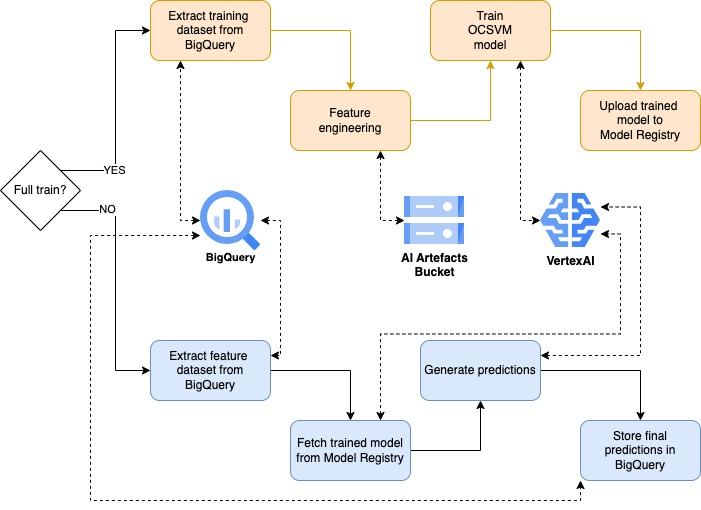

# Anomaly Detection MLOps Pipelines

## Introduction
This Git repository contains a collection of MLOps pipelines for anomaly detection in time series data, implemented using Google Cloud AI Platform Pipelines and Vertex AI. The pipelines are designed to automate the process of:
- training 
- deploying machine learning models
- generate predictions in a batch fashion

for anomaly detection, and demonstrate some of the many practices for MLOps.
The pipelines are implemented in Python using the KFP SDK and leverage the Google Cloud AI Platform Pipelines SDK to automate the process of training and deploying models.

## Infrastructure Design



## Data
The data used for this project is pogramatically generated and simulates the use case of an application that gets new users installed for a certain period of time.
Code and automation can be found in `/data` folder.

Here is a brief explanation of the files:
- `schema.json`: JSON file that defines the table schema used to hold the feature data in BigQuery.
- `manage_data.py`: Python scrit that automates the handling of data in BigQuery. It takes two aguments:
    - *insert* to create new data
    - *truncate* to eliminate the data inside the table

## Pipelines
Pipelines built with VertexAI are used for two main scopes:

### Full Train
This pipelines performs the following steps:
- get raw input from BigQuery
- preprocess the features for the training phase
- train one One-Class SVM model as there are combinations of *country_code + platform + channel*
- load the trained model on a Model Registry

### Batch Predictions
This pipeline performs the following steps:
- get trained model URI from Model Registry
- generate a temporary table on BigQuery where features are loaded for predictions
- download the model locally to the container
- run a batch prediction job via `model.predict()` method
- store prediction on a table in BigQuery

## Testing

## Automation
### Setup
To initially set up the project, make sure to have an active GCP account and change the following parameters in the `Makefile`:

```bash
PROJECT_ID = ...
BUCKET_NAME = ...
ENV = ...
```
Later on a Terminal run:
```bash
make create
```

### Run pipelines
Two commands are used to either train or run inference:
```bash
make train
make infer
```

### Clean up
On a Terminal run:
```bash
make destroy
```